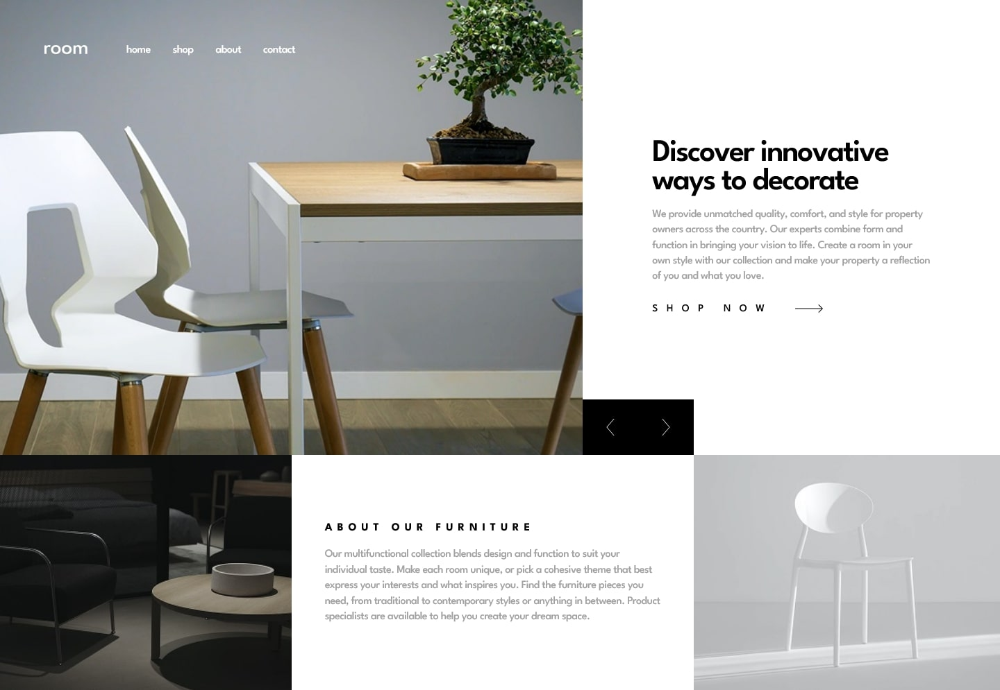

# Frontend Mentor - Room homepage solution

This is a solution to the [Room homepage challenge on Frontend Mentor](https://www.frontendmentor.io/challenges/room-homepage-BtdBY_ENq). Frontend Mentor challenges help you improve your coding skills by building realistic projects.

## Table of contents

- [Overview](#overview)
  - [Screenshot](#screenshot)
  - [Links](#links)
- [My process](#my-process)
  - [Built with](#built-with)
- [Author](#author)

## Overview

### Screenshot

### Links

- Solution URL: [https://github.com/aszxqaz/fm-room-homepage](https://github.com/aszxqaz/fm-room-homepage)
- Live Site URL: [https://aszxqaz.github.io/fm-room-homepage](https://aszxqaz.github.io/fm-room-homepage)

## My process

### Built with

- Vue

## Author

- Frontend Mentor - [@aszxqaz](https://www.frontendmentor.io/profile/aszxqaz)
- GitHub - [@aszxqaz](https://www.github.com/aszxqaz)
